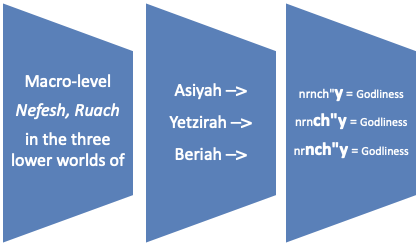

***Shaar* 3 Chapter 3**

וְהִנֵּה אָמַרְנוּ כִּי יֵשׁ נרנח"י כְּלָלִיִּים ונרנח"י פְּרָטִיִּים

**We said in the previous chapter that there is a macro-level *nefesh*, *ruach*, *neshama*, *chaya*, *yechida*, and also micro-levels of *nefesh*, *ruach*, *neshama*, *chaya*, *yechida*. We will abbreviate this below as *nrnch"y* where appropriate.**

וְהָיִינוּ שכ"א מהנרנח"י הַכְּלָלִיִּים הִנֵּה כָּלוּל כ"א ג"כ מנרנח"י וְכַנָּ"ל

**That is to say, each of the macro-levels of *nrnch"y* also comprises micro-levels of *nrnch"y*.**

אָמְנָם הִנֵּה יֵשׁ חִלּוּק גָּדוֹל בֵּין הנרנח"י הַכְּלָלִיִּים להנרנח"י הַפְּרָטִיִּים

**Nevertheless, there is a tremendous difference between the macro-level *nrnch"y* and the micro-level *nrnch"y*,**

כִּי הנרנח"י הַכְּלָלִיִּים הִנֵּה הָרוּחַ וְהַנֶּפֶשׁ הַכְּלָלִיִּים הֵם נִבְרָאִים נוֹצְרִים נַעֲשִׂים

**because the macro-level *ruach* and *nefesh* of *nrnch"y* are created, formed and made,**

וְהֵם אֵינָם אֱלָהוּת כְּלָל

**and they are not Godly at all** (according to what we will explain below).

אָבֵל הַנְּשָׁמָה וְהֶחָיָה וְהַיְּחִידָה הַכְּלָלִיִּים אֵלוּ הג' הֵם כֻּלָּם אֱלָהוּת גָּמוּר

**But *neshama*, *chaya* and *yechida* in the macro sense – all three – are all entirely Godliness,**

גַּם בְּהָעוֹלָמוֹת בי"ע.

**even in the Worlds of *Beriah*, *Yetzirah* and *Asiyah*.**

שֶׁאַפִי' בְּעוֹלַם הָעֲשִׂיָּה הֲוָה מֵהַנְּשָׁמָה הַכְּלָלִית וּלְמַעְלָה כֻּלּוֹ אֱלָהוּת גָּמוּר

**So that even in the World of *Asiyah* the macro-level of *neshama* and above are all entirely Godliness,**

כִּי הַנְּשָׁמָה הַכְּלָלִית אֲשֶׁר גַּם בְּהָעֲשִׂיָּה הִנֵּה הִיא מֵעוֹלָם הָאֲצִילוּת

**since the macro-level of *neshama*, even in *Asiyah*, is from the World of *Atzilut***

אֲשֶׁר הוּא אֱלָהוּת גָּמוּר כְּמוֹ שֶׁיִּתְבָּאֵר בַּשְּׁעָרִים הַבָּאִים.

**which is entirely Godliness, as will be explained in the coming sections.**

אָמְנָם הנרנח"י הַפְּרָטִיִּים אֲשֶׁר יֶשְׁנָם גַּם בְּהַנֶפֶשׁ וְהָרוּחַ הַכְּלָלִיִּים

**However, the micro-level *nrnch"y*, which are sub-strata in macro-level *nefesh* and *ruach* as well,**

הִנֵּה יֵשׁ בָּהֶם בְּחִי' שֶׁהֵם אֱלָהוּת וְיֵשׁ בָּהֶם בְּחִי' שֶׁאֵינָם אֱלָהוּת

**have aspects which are Godliness and aspects which are not Godliness.**

וְיֵשׁ חִלּוּק בְּזֶה בֵּין הָעוֹלָמוֹת

**In this respect there is a difference between the Worlds:**

כִּי בְּעוֹלַם הָעֲשִׂיָּה הֲוָה הַאֲלָהוֹת שֶׁבָּהֶם רַק הַיְּחִידָה לְבַד שֶׁבָּהֶם

**in the World of *Asiyah* the Godliness in it is only in its *yechida*,[^1]**

כִּי הַיְּחִידָה הַפְּרָטִית אֲשֶׁר גַּם בְּהַרְוּחַ וְהַנֶּפֶשׁ הַכְּלָלִיִּים דְּהָעֲשָׂיָה הוּא אֱלָהוּת גָּמוּר

**since the micro-level *yechida*, even in macro-level *ruach* and *nefesh* of *Asiyah*, is entirely Godliness.**

אָבֵל מֵהַחַיָּה וּלְמַטֶּה אֲשֶׁר בְּהַרְוּחַ וְהַנֶּפֶשׁ הַכְּלָלִיִּים דְּהָעֲשָׂיָה הֵם אֵינָם אֱלָהוּת כְּלָל.

**But from *chaya* and below in the macro-level *ruach* and *nefesh* of *Asiyah* is not Godliness at all.**

וּבָעוֹלָם הַיְּצִירָה הֲוָה גַּם הֶחָיָה הַפְּרָטִית אֲשֶׁר בְּהַרְוּחַ וְהַנֶּפֶשׁ הַכְּלָלִיִּים דְּהַיְּצִירָה ג"כ אֱלָהוּת גָּמוּר

**In the World of *Yetzirah* even micro-level *chaya* of macro-level *ruach* and *nefesh* of *Yetzirah* is entirely Godliness.**

אַךְ מֵהַנְּשָׁמָה הַפְּרָטִית וּלְמַטָּה אֲשֶׁר בְּהַרְוּחַ וְנֶפֶשׁ הַכְּלָלִיִּים דְּהַיְּצִירָה

**But the micro-level *neshama* and lower of the macro-level *ruach* and *nefesh***

הֵם אֵינָם אֱלָהוּת כְּלָל.

**are not Godliness at all.**

וּבָעוֹלָם הַבְּרִיאָה הֲוָה גַּם הַנְּשָׁמָה הַפְּרָטִית אֲשֶׁר בְּהַרְוּחַ וְהַנֶּפֶשׁ הַכְּלָלִים דְּהַבְּרִיאָה ג"כ אֱלָהוּת גָּמוּר

**However, in the World of *Beriah* even the micro-level *neshama* of macro-level *ruach* and *nefesh* of *Beriah* is also entirely Godliness.**

וְרַק הָרוּחַ וְהַנֶּפֶשׁ הַפְּרָטִיִּים אֲשֶׁר בְּרוּחַ וְנֶפֶשׁ הַכְּלָלִיִּים דְּהַבְּרִיאָה

**Only the micro-level *ruach* and *nefesh* of macro-level *ruach* and *nefesh* of *Beriah***

הֵם אֵינָם אֱלָהוּת כְּלָל.

**are not Godliness at all.**

וְנִמְצָא כִּי בָּעוֹלָם הַבְּרִיאָה הֲוָה אֱלָהוּת מֵהַנְּשָׁמָה וּלְמַעְלָה לְעוֹלָם

**It turns out that the World of *Beriah* is Godliness from the level of *neshama* and above,**

ר"ל גַּם הַנְּשָׁמָה הַפְּרָטִית אֲשֶׁר בְּהַרְוּחַ וְנֶפֶשׁ הַכְּלָלִיִּים שֶׁבָּהּ

**i.e. including the micro-level *neshama* of macro-level *ruach* and *nefesh* in it – in the World of *Beriah*.**

אֲבָל בְּעוֹלָם הַיְּצִירָה הֲוָה הַאֲלָהוֹת אֲשֶׁר גַּם בְּהַרְוּחַ וְהַנֶּפֶשׁ הַכְּלָלִיִּים שֶׁבּוֹ רַק מֵהֶחָיָה וּלְמַעְלָה.

**But in the World of *Yetzirah* there is Godliness in the macro-level *ruach* and *nefesh* only from the level of *chaya* and above i.e. *yechida*.**

אַךְ בְּעוֹלַם הָעֲשִׂיָּה לֹא הֲוָה אֱלָהוּת בָּרוּחַ וְנֶפֶשׁ הַכְּלָלִיִּים שֶׁבָּהּ

**Whereas in the World of *Asiyah* there is no Godliness in its macro-level *ruach* and *nefesh***

אֶלָּא רַק הַיְּחִידָה לְבַד שֶׁבָּהֶם.

**other than in its *yechida*.**

וַהֲרֵי נִמְצָא מכ"ז כִּי הַיְּחִידָה הִיא לְעוֹלָם אֱלָהוּת

**So it emerges from all of this that *yechida* is always Godliness,**

ור"ל גַּם הַיְּחִידָה הַפְּרָטִית אֲשֶׁר גַּם בְּרוּחַ וְנֶפֶשׁ הַכְּלָלִיִּים דְּהָעֲשָׂיָה

**meaning to say, including the micro-level *yechida* of *ruach* and *nefesh* on the macro-level.**

אֲבָל הָרוּחַ וְהַנֶּפֶשׁ הַפְּרָטִיִּים דְּהָרוּחַ וְנֶפֶשׁ הַכְּלָלִיִּים

**But the micro-level *ruach* and *nefesh* of macro-level *ruach* and *nefesh***

הֵם לְעוֹלָם אֵינָם אֱלָהוּת אַפִי' בְּעוֹלַם הַבְּרִיאָה

**are never Godliness, even in the World of *Beriah*.**

אַךְ הַנְּשָׁמָה וְהַחַיָה הִנֵּה בָּעוֹלָם הַבְּרִיאָה הֵם ג"כ אֱלָהוּת גָּמוּר לְעוֹלָם

**Whereas *neshama* and *chaya* in the World of *Beriah* are also always entirely Godliness.**

ור"ל אַפִי' הַנְּשָׁמָה וְהַחַיָה הַפְּרָטִיִּים אֲשֶׁר גַּם בְּהַרְוּחַ וְהַנֶּפֶשׁ הַכְּלָלִיִּים

**Meaning to say, even the micro-level *neshama* and *chaya* of *ruach* and *nefesh* on the macro-level are entirely Godliness.**

אֲבָל בִּיצִירָה הֲוָה הַאֲלָהוֹת רַק מֵהֶחָיָה לְבַד אַךְ לֹא מֵהַנְּשָׁמָה וּלְמַטֶּה

**But in the World of *Yetzirah* there is Godliness only in *chaya* and above, but not from *neshama* and below.**

וּבְעוֹלַם הָעֲשִׂיָּה הוּא רַק הַיְּחִידָה לְבַד וְלֹא מֵהַחַיָּה וּלְמַטָּה.

**And in the World of *Asiyah* only *yechida* is Godliness, but from *chaya* down is not.**

וכ"ז הוּא רַק בְּהַנְשָׁמָה וְהַחַיָה הַפְּרָטִיִּים אֲשֶׁר בְּרוּחַ וְנֶפֶשׁ הַכְּלָלִיִּים

**All of this is only as regards the micro-level *neshama* and *chaya* of *ruach* and *nefesh* on the macro-level,**

אֲבָל הַנְּשָׁמָה וְהַחַיָה הַכְּלָלִים ומכש"כ הַיְּחִידָה

**but as for macro-level *neshama* and *chaya* —**

הֵם כֻּלָּם לְעוֹלָם אֱלָהוּת גָּמוּר בְּכָל חֶלְקֵי הנרנח"י שֶׁבָּהֶם גַּם בָּעוֹלָם הָעֲשִׂיָּה

**– they are always entirely Godliness in all their aspects of *nrnch"y*, even in the World of *Asiyah*.**

\[וכמ"ש הָאֲרִיזָ"ל בְּשַׁעַר הַצֶּלֶם פ"א וּבְשַׁעַר הַשֵּׁמוֹת פ' א' ב' ובכ"מ

**\[As the Arizal writes in *Shaar HaTzelem* chapter 1, and in *Shaar HaShemot* chapters 1 & 2, and in a number of other places.**

וְכֵן כְּתָב ג"כ הַגְּרָ"א זַ"ל בְּהֵיכְלוֹת בְּרֵאשִׁית הֵיכַל א' בְּסֵפֶר יָהֵל אוֹר דַּף י"א ע"ד.

**The GR"A also writes thus in his commentary on the section of the *Zohar* known as the *Heichalot*, *Bereishit*, *Heichal* 1, printed in his book *Yahel Ohr* p. 11d.**

וּבְמָה שֶׁכָּתַבְתִּי הַחִלּוּק בֵּין הַכְּלָלִים לְהַפְּרָטִים

**And this distinction between the macro and micro levels that we wrote about**

בְּזֶה יִתְיַשֵּׁב דִּבְרִי הַגְּרָ"א בְּלִקּוּטָיו שֶׁבְּסוֹף הספד"צ דה"מ יָדוּעַ שֶׁהֶבְדֵּל עַצְמִי כּוּ' ע"ש

**resolves an apparent contradiction in the words of the GR"A in his *Likutim* at the end of his commentary on the section of the *Zohar* known as the *Sifra d'Tziniuta*, beginning with "It is known that there is an essential difference…"**

שֶׁהוּא נִרְאֶה כְּסוֹתֵר אֶת עַצְמוֹ לְמָּה שֶׁכָּתַב בְּהֵיכְלוֹת הַנִז'

**in which he appears to contradict himself regarding his commentary to the aforementioned *Heichalot*.**

אֲבָל לְפִי מָה שֶׁכָּתַבְתִּי הוּא נִיחָא

**But according to our explanation written above, there is no problem,**

כִּי בְּלִקּוּטָיו שָׁם מְדַבֵּר בהנרנח"י שֶׁבַּנֶּפֶשׁ רוּחַ הַכְּלָלִיִּים

**because in his *Likutim* he is referring to *nrnch"y* of *nefesh* and *ruach* on the macro-level,**

כִּי רַק הֵם לְבַד הֵם עִקַּר מַדְרֵגַת דְּהָעוֹלָמוֹת בי"ע

**since only they are the primary level of the Worlds of *Beriah*, *Yetzirah* and *Asiyah* –**

וְהוּא מַדְרֵגַת הָאָדָם וְהַבֵן\]:

**and this is the level of man. Understand this.\]**

---

To summarize the contents of this chapter, the diagram[^2] below may help:

**Macro-level *neshama*, *chaya*, *yechida* are always Godliness, but –**

| | *Nefesh* (micro) | *Ruach* (micro) | *Neshama* (micro) | *Chaya* (micro) | *Yechida* (micro) |
|---|---|---|---|---|---|
| *Beriah* | Not Godliness | Not Godliness | Godliness | Godliness | Godliness |
| *Yetzirah* | Not Godliness | Not Godliness | Not Godliness | Godliness | Godliness |
| *Asiyah* | Not Godliness | Not Godliness | Not Godliness | Not Godliness | Godliness |

Thus, micro-level *nefesh* and *ruach* are never Godliness, whereas micro-level *yechida* is always Godliness.

[^1]: Literally, "…the Godliness in them is only in their *yechida*."

[^2]: From the Makover edition.
